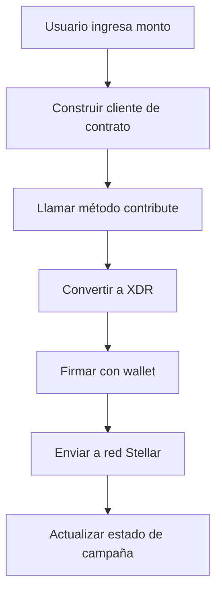

# Soroban Contract Integration

Este documento describe la integración del sistema de donaciones con contratos inteligentes de Soroban en la red de Stellar.

## 🏗️ Arquitectura del Sistema

### Componentes Principales

1. **`ICrowdfundingContract`** - Interfaz del contrato
2. **`StellarService`** - Servicio para interactuar con la red Stellar
3. **`ActionButtons`** - Componente para acciones de campaña
4. **`DonationForm`** - Formulario de donación integrado con contratos

## 🔧 Implementación Actual

### Estado del Sistema

- ✅ **Integración de Contratos**: Estructura completa para llamadas a contratos
- ✅ **Firma de Transacciones**: Integración con wallets (Freighter, xBull, Albedo)
- ✅ **Envío de Transacciones**: Simulación de envío a la red
- ⚠️ **Contratos Reales**: Actualmente usando mocks para desarrollo

### Flujo de Donación



## 📁 Estructura de Archivos

```
src/
├── interfaces/
│   └── contract.interface.js     # Interfaz del contrato
├── services/
│   └── stellar.service.js        # Servicio de Stellar
├── components/
│   ├── DonationForm.jsx          # Formulario de donación
│   └── ActionButtons.jsx         # Botones de acción
└── actions/
    └── makeDonations.js          # Funciones de donación
```

## 🚀 Uso del Sistema

### 1. Hacer una Donación

```javascript
import { useWallet } from '../hooks/useWallet';
import { stellarService } from '../services/stellar.service';

const { walletAddress, signTransaction } = useWallet();

const makeDonation = async (amount, campaignAddress) => {
  // Construir cliente del contrato
  const contractClient = await stellarService.buildClient(walletAddress);
  
  // Convertir monto a stroops
  const amountInStroops = Math.floor(amount * 10000000);
  
  // Llamar método del contrato
  const result = await contractClient.contribute({
    contributor: walletAddress,
    campaign_address: campaignAddress,
    amount: amountInStroops
  });
  
  // Firmar transacción
  const signedTx = await signTransaction(result.toXDR());
  
  // Enviar a la red
  const hashId = await stellarService.submitTransaction(signedTx);
  
  return hashId;
};
```

### 2. Obtener Detalles de Campaña

```javascript
import { stellarService } from '../services/stellar.service';

const getCampaignDetails = async (campaignAddress) => {
  const contractClient = await stellarService.buildClient();
  
  const campaign = await contractClient.getCampaign(campaignAddress);
  return campaign;
};
```

### 3. Procesar Reembolso

```javascript
const processRefund = async (campaignAddress) => {
  const contractClient = await stellarService.buildClient(walletAddress);
  
  const result = await contractClient.refund({
    contributor: walletAddress,
    campaign_address: campaignAddress
  });
  
  const signedTx = await signTransaction(result.toXDR());
  const hashId = await stellarService.submitTransaction(signedTx);
  
  return hashId;
};
```

## 🔄 Estados de Transacción

### Flujo de Estados

1. **Building** - Construyendo transacción del contrato
2. **Calling** - Llamando método del contrato
3. **Converting** - Convirtiendo resultado a XDR
4. **Signing** - Firmando con wallet
5. **Submitting** - Enviando a la red
6. **Success/Error** - Resultado final

### Manejo de Errores

```javascript
try {
  // Proceso de donación
} catch (error) {
  if (error.message.includes('insufficient balance')) {
    // Manejar saldo insuficiente
  } else if (error.message.includes('campaign not found')) {
    // Manejar campaña no encontrada
  } else {
    // Error genérico
  }
}
```

## 🧪 Testing y Desarrollo

### Configuración de Testnet

```bash
# Variables de entorno
VITE_STELLAR_NETWORK=testnet
VITE_HORIZON_URL=https://horizon-testnet.stellar.org
VITE_SOROBAN_RPC_URL=https://soroban-testnet.stellar.org
```

### Datos Mock

El sistema actual usa datos mock para:
- Detalles de campaña
- Contribuciones de usuario
- Respuestas de contrato
- Hashes de transacción

### Próximos Pasos para Producción

1. **Integrar Contratos Reales**: Reemplazar mocks con llamadas reales
2. **Validación de Red**: Verificar conectividad con testnet/producción
3. **Manejo de Errores**: Implementar manejo robusto de errores de red
4. **Monitoreo**: Agregar logging y monitoreo de transacciones

## 🔐 Seguridad

### Consideraciones

- **Claves Privadas**: Nunca exponer en el frontend
- **Validación**: Validar todas las entradas del usuario
- **Rate Limiting**: Implementar límites de tasa para transacciones
- **Auditoría**: Registrar todas las transacciones para auditoría

### Mejores Prácticas

```javascript
// Validar dirección de Stellar
const isValidAddress = (address) => {
  return /^[A-Z0-9]{56}$/.test(address);
};

// Validar monto
const isValidAmount = (amount) => {
  return amount > 0 && amount <= MAX_DONATION_AMOUNT;
};

// Sanitizar entradas
const sanitizeInput = (input) => {
  return input.trim().replace(/[<>]/g, '');
};
```

## 📚 Recursos Adicionales

### Documentación Oficial

- [Stellar Documentation](https://developers.stellar.org/)
- [Soroban Documentation](https://soroban.stellar.org/)
- [Stellar SDK](https://github.com/stellar/js-stellar-sdk)

### Herramientas de Desarrollo

- [Stellar Laboratory](https://laboratory.stellar.org/)
- [Soroban Playground](https://playground.soroban.stellar.org/)
- [Stellar Expert](https://stellar.expert/)

## 🤝 Contribución

Para contribuir al desarrollo:

1. Fork del repositorio
2. Crear rama feature (`git checkout -b feature/nueva-funcionalidad`)
3. Commit cambios (`git commit -am 'Agregar nueva funcionalidad'`)
4. Push a la rama (`git push origin feature/nueva-funcionalidad`)
5. Crear Pull Request

## 📞 Soporte

Para preguntas o problemas:

- Crear issue en GitHub
- Revisar documentación existente
- Consultar logs de consola para debugging
- Verificar configuración de red y variables de entorno 